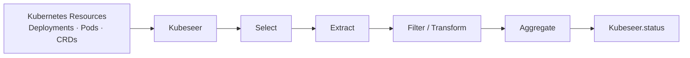

# Kubeseer

**Declarative, typed views and aggregations over Kubernetes resources.**

Kubeseer is a Kubernetes operator that lets you query, filter, transform, and aggregate Kubernetes resources declaratively — without writing a purpose-built controller.

Define a `Kubeseer` custom resource describing what to observe and which values you need. Kubeseer continuously evaluates the selected resources and publishes a deterministic, typed view in the custom resource's `status`.



## Why Kubeseer?

Kubernetes already gives you powerful ways to inspect resources using `kubectl`, JSONPath, field selectors, and external tools such as `jq`.

Those approaches work well for ad-hoc queries.

Kubeseer addresses a different use case: **turning a resource query or aggregation into declarative Kubernetes state that is continuously reconciled.**

For example, instead of writing and operating a custom controller just to calculate a value from several Kubernetes objects, you can declare the view you want and let Kubeseer maintain it.

### Example: aggregate Deployments across namespaces

Suppose you want the total number of declared replicas across Deployments in two namespaces.

Declare it as a Kubernetes resource:

```yaml
apiVersion: kubeseer.io/v1alpha1
kind: Kubeseer
metadata:
  name: aggregation
  namespace: application-a
spec:
  sources:
    - id: deployments
      resource:
        apiVersion: apps/v1
        kind: Deployment
      namespaces:
        names:
          - application-a
          - application-b
      fields:
        - name: replicas
          path: "{.spec.replicas}"
          type: integer
      aggregations:
        - name: total
          function: sum
          field: replicas
```

Kubeseer discovers the matching resources, extracts `spec.replicas` as typed integers, calculates the aggregate, and keeps the result updated in the `Kubeseer` resource status as the cluster changes.

No application-specific controller is required.

## What Kubeseer can do

Kubeseer can build views over both built-in Kubernetes objects and structural Custom Resources.

It supports:

- resource discovery for built-in APIs and CRDs;
- selection by namespace, exact name, labels, label expressions, and field selectors;
- queries spanning multiple namespaces;
- field extraction through a deliberately restricted, non-executable JSONPath subset;
- Kubernetes-aware typed values including strings, integers, numbers, booleans, timestamps, durations, quantities, objects, and lists;
- predicates and transformations such as `gte`, `contains`, `matches`, `in`, `default`, and `coalesce`;
- deterministic `collect`, `count`, `sum`, `min`, `max`, `average`, `first`, `last`, and `distinct` aggregations;
- optional provenance linking results back to their source resources;
- partial results when an isolated source becomes unavailable;
- explicit conditions, summaries, sanitized errors, Kubernetes Events, Prometheus metrics, structured logs, and optional tracing.

## Kubernetes-native security model

Kubeseer does not bypass Kubernetes authorization.

Every read is constrained by both:

1. the Kubernetes RBAC permissions granted to the Kubeseer controller; and
2. the administrator-controlled `installation-access-ceiling` policy.

Admission validation and runtime revalidation ensure that a `Kubeseer` resource cannot expand its effective access beyond the scope authorized by the cluster administrator.

Kubeseer fails closed when authorization cannot be established.

## Typical use cases

Kubeseer is useful when you need a Kubernetes-native, continuously maintained view derived from existing cluster resources.

Examples include:

- summing requested or declared values across workloads;
- collecting selected fields from resources spread across multiple namespaces;
- filtering Custom Resources by typed status values;
- exposing a concise derived status from a larger set of Kubernetes objects;
- building inputs for another controller without coupling it directly to many different resource types;
- replacing small, application-specific aggregation controllers with declarative resources;
- maintaining deterministic inventories or summaries directly inside the Kubernetes API.

For one-off interactive inspection, `kubectl`, JSONPath, or `jq` may be simpler. Kubeseer is designed for cases where the query itself should become **declarative, persistent, and continuously reconciled Kubernetes state**.

## Install an official release

After a maintainer publishes an official stable release, install its versioned
Helm OCI artifact and matching public controller image directly from GHCR. This
path needs Helm and cluster access; it does not need a repository checkout or a
local image/chart build. Replace `0.1.6` with a version listed on the
[GitHub Releases page](https://github.com/steeltanuki/kubeseer/releases):

```sh
helm upgrade --install kubeseer oci://ghcr.io/steeltanuki/charts/kubeseer \
  --version 0.1.6 --namespace kubeseer-system --create-namespace \
  --wait --timeout 10m
```

The chart defaults to `ghcr.io/steeltanuki/kubeseer:<chart appVersion>`, so
the selected chart and controller versions stay aligned. The image and chart
GHCR packages for a published release are public for anonymous pulls. The
initial release contract certifies Linux/amd64 controller images, Kubernetes
1.35.6 and 1.36.2, and Helm 3.12 or newer. See the
[installation and lifecycle guide](docs/installation.md) for prerequisites,
upgrades, rollback, and recovery.

## Install or build from source

Contributors can clone the source to change Kubeseer, run its verification
gates, or inspect and package the canonical chart locally. Those locally built
images and charts are development artifacts; official versions are published
only by the maintainer-controlled version-tag release workflow. See the
[contribution guide](CONTRIBUTING.md) for issues and pull requests, and
[development and verification](docs/development.md) for build and test
commands.

## Local development quick start

The project-owned local environment uses Linux/amd64 with rootless Podman and
kind. It builds and loads temporary local images without publishing them:

```sh
make local-check
make local-up
make local-examples
make local-verify
make local-status
```

Inspect one example through the constrained helper:

```sh
make local-example EXAMPLE=builtin-resource ACTION=inspect
```

When finished, remove the example fixtures and the owned kind cluster:

```sh
make local-examples-down
make local-down
```

The complete prerequisites, fixed identities, diagnostics, and failure
semantics are in the [local development guide](docs/local-development.md).
For a real cluster, follow the [installation and lifecycle guide](docs/installation.md).

## A minimal resource

This resource reads one Deployment from its own namespace and publishes the
declared replica count as an integer:

```yaml
apiVersion: kubeseer.io/v1alpha1
kind: Kubeseer
metadata:
  name: deployment-view
  namespace: applications
spec:
  sources:
    - id: deployment
      resource:
        apiVersion: apps/v1
        kind: Deployment
      selector:
        name: web
      fields:
        - name: replicas
          path: "{.spec.replicas}"
          type: integer
```

Omitting `namespaces` means the containing namespace for a namespaced resource.
Creation succeeds only if admission can resolve the target and the requested
scope fits the active installation policy. At runtime the controller must also
hold exact logical authorization and Kubernetes RBAC before it performs a
`LIST` or maintains a source watch.

Use conditions first when reading the result:

```sh
kubectl -n applications get kubeseer deployment-view \
  -o jsonpath='{range .status.conditions[*]}{.type}={.status} ({.reason}){"\n"}{end}'
kubectl -n applications get kubeseer deployment-view -o yaml
```

`Ready=True` means the current generation produced its intended semantic
result. `Degraded=True` means a useful partial result was retained while at
least one isolated evaluation failed. See [API reference](docs/api-reference.md)
for the complete status contract.

## Documentation

| Guide | Use it for |
| --- | --- |
| [Contributing](CONTRIBUTING.md) | Issue reports, proposals, pull requests, review, and maintainer responsibilities |
| [Concepts and architecture](docs/concepts-and-architecture.md) | Mental model, evaluation pipeline, reconciliation, and package boundaries |
| [API reference](docs/api-reference.md) | `Kubeseer` and `KubeseerAccessPolicy` fields, JSONPath, types, operators, aggregations, and status |
| [Configuration](docs/configuration.md) | Helm policy, RBAC, certificates, limits, and deployment settings |
| [Installation and lifecycle](docs/installation.md) | Production install, upgrades, rollback, uninstall, purge, and compatibility checks |
| [Security model](docs/security.md) | Trust boundaries, authorization, data exposure, and hardening |
| [Operations](docs/operations.md) | Health, metrics, Events, status interpretation, and operational diagnosis |
| [Local development](docs/local-development.md) | Persistent kind-on-Podman environment and supported local workflow |
| [Development and verification](docs/development.md) | Repository layout, generation, test layers, E2E, and Walden workflow |
| [Examples](docs/examples.md) | Runnable scenario catalog and expected outcomes |
| [Troubleshooting](docs/troubleshooting.md) | Symptom-oriented checks and recovery procedures |
| [Helm values reference](charts/kubeseer/README.md) | Every supported chart value and its default |

The generated CRDs under `config/crd/bases/` are the machine-readable API
schema. [SPECIFICATIONS.md](SPECIFICATIONS.md) explains the feature portfolio;
the approved requirements, designs, task plans, and verification evidence live
under `.walden/`.

## Compatibility

| Component | Supported or verified value |
| --- | --- |
| Kubernetes API | `kubeseer.io/v1alpha1` |
| Kubernetes | 1.35.6 and 1.36.2 |
| Helm chart gate | `>=1.35.0-0 <1.37.0-0` |
| Helm | 3.12 or newer |
| Default certificate provider | cert-manager v1.18.2 |
| Local environment | Linux/amd64, rootless Podman, kind |

The exact development toolchain and kind node-image pins are defined in
[`hack/toolchain.mk`](hack/toolchain.mk).

## Project status and delivery model

The Walden portfolio tracks Kubeseer's API, controller behavior, verification,
packaging, local development, and official release distribution. Each feature
is backed by approved requirements, design, implementation tasks, and
verification evidence.

Kubeseer is also an experiment in specification-driven delivery with
[Walden](https://github.com/andrearaponi/walden) and AI coding agents. Features
progress through reviewed requirements, design, task planning, implementation,
and durable verification evidence. AI agents may assist at each stage;
architectural approval and responsibility for the result remain with the human
maintainer.

Contributors may use Walden, but it is optional. For an ordinary issue or pull
request, the maintainer decides whether a specification is needed and manages
any required approval and evidence before integration.

Before treating a commit as release-ready, run the repository verification
appropriate to the change and the isolated `make e2e` certification described
in [development and verification](docs/development.md).

## Acknowledgments

Kubeseer began with a conversation. We are grateful to Prof. Fulvio Risso for
the exchange that first sparked the idea for this project.

## License

Kubeseer is licensed under the Apache License 2.0. See [LICENSE](LICENSE).
